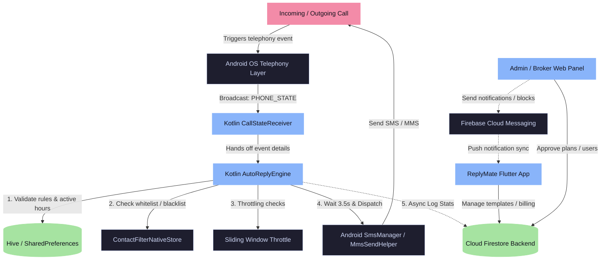

# **ReplyMate: Automated SMS Response System & Management Suite**

An enterprise-grade, dual-app ecosystem featuring a background-intensive **Flutter Mobile Application** for automated, context-aware call-response management, and a **Flutter Web Management Portal** for administrators and reseller brokers to manage plans, subscriptions, and real-time activity analytics.

---

## 📸 Core Products & Architecture

This monorepo contains the following two major projects:

1. **`ReplyMate` (Mobile App)**: A background-resident Android application built using Flutter and Kotlin that intercepts telephony call states (ringing, busy, missed, rejected, answered) and automatically dispatches context-specific SMS or MMS messages based on user preferences.
2. **`admin_broker` (Admin & Broker Dashboard)**: A Flutter Web dashboard built using Riverpod and GoRouter. It provides hierarchical administration panels for global administrators to configure subscriptions and for reseller brokers to onboard, approve, and manage customer bases.

---

## 🏗 High-Level System Flow



---

## 🛠 Tech Stack

### Mobile Client (`ReplyMate`)
- **Core Framework**: Flutter (Dart)
- **Native Platform Layer**: Kotlin (Android SDK: BroadcastReceivers, Foreground Services, RoleManager)
- **Local Storage / Cache**: Hive (local database) & SharedPreferences (native caching)
- **State Management**: GetX (with reactive variables and bindings)
- **Cloud Backend**: Firebase Auth (Phone Login) & Cloud Firestore (real-time stats / templates)
- **Push System**: Firebase Cloud Messaging (FCM)
- **Hardware Integration**: Dual-SIM subscription detection, telephony state listeners, SMS/MMS API

### Admin & Web Portal (`admin_broker`)
- **Core Framework**: Flutter Web (responsive layouts)
- **State Management**: Riverpod (fully optimized using code generation and custom lints)
- **Routing**: GoRouter (declarative shell navigation)
- **Cloud Backend**: Firebase Auth & Cloud Firestore
- **Serverless Compute**: Firebase Cloud Functions (Node.js backend)
- **UI Components**: Charts (`fl_chart`), network image caching (`cached_network_image`), and shimmering placeholders
- **Deployment**: Netlify Web Hosting (redirect rules & environment config)

---

## ⚡ How It Works (Deep Dive)

### 1. Native Broadcast Interception & Foreground Availability
The application intercepts calls at the OS level using a Kotlin `BroadcastReceiver` listening to the `android.intent.action.PHONE_STATE` action. Because Android aggressively terminates background processes, the listening is managed by a persistent `AutoReplyForegroundService` utilizing a persistent status bar notification, ensuring uninterrupted service.

### 2. The 3.5-Second Hardware Cooldown Delay
On most Android devices, attempting to dispatch an SMS/MMS immediately after a call ends results in a hardware failure, as the cellular modem is occupied releasing the voice channel. `AutoReplyEngine` addresses this by spawning a coroutine, executing a **3.5-second thread pause**, and only then handing off the payload to `SmsManager`. This ensures high-reliability dispatch rates.

### 3. Dual-SIM Aware Routing
For multi-SIM devices, `AutoReplyEngine` leverages Android's `SubscriptionManager` to fetch active SIM subscription profiles (`SubscriptionInfo`). The engine matches the incoming SIM slot to the configured store templates and dynamically instantiates an instance of `SmsManager` bound to the correct `SubscriptionId` using:
```kotlin
val smsManager = context.getSystemService(SmsManager::class.java).createForSubscriptionId(subscriptionId)
```

### 4. Sliding-Window Rate Throttling
To prevent continuous automated replies to active numbers (e.g. repeated redialing), the Kotlin layer tracks last-dispatched timestamps per contact in native `SharedPreferences`. If a call matches a contact within the configured cooldown window, the engine bypasses dispatching and emits a `throttled` UI notification.

### 5. Multi-Tenant Firestore Rules
The admin portal handles two roles: **Admins** and **Brokers**. Firestore security rules isolate documents:
- **Brokers** can only query and write to user records that match their broker ID.
- **Admins** maintain global write privileges for billing plans, system settings, and global stats collections.

---

## 📂 Key Directory Structure

```
RR (Workspace Root)
├── ReplyMate/                  # Mobile Application (Flutter & Android Kotlin)
│   ├── android/                # Native Android code (Services, BroadcastReceivers, MMS helpers)
│   ├── lib/
│   │   ├── core/               # Routing, theme, native channels, and background services
│   │   └── features/           # Feature UI modules (Dashboard, Logs, Config, Subscriptions)
│   └── pubspec.yaml
│
├── admin_broker/               # Web Management Suite (Flutter Web)
│   ├── lib/
│   │   ├── screens/            # Dashboards, Revenue lists, Broker approvals, Settings
│   │   ├── models/             # Shared Firestore schema converters
│   │   └── services/           # Firebase connection layer & functions bridge
│   ├── functions/              # Firebase Cloud Functions (Node.js backend)
│   ├── netlify.toml            # Deployment Configuration for Web Hosting
│   └── pubspec.yaml
│
└── README.md                   # Project Documentation
```

---

## 🚀 Setup & Execution Guide

### 1. Prerequisites
- Flutter SDK (v3.27+ for Web / v3.9+ for Mobile)
- Android Studio with Android SDK 34+
- Firebase CLI (`npm install -g firebase-tools`)

### 2. Mobile App Setup (`ReplyMate`)
```bash
cd ReplyMate
flutter pub get
# Connect an Android device (Physical device recommended for SIM features)
flutter run
```

### 3. Admin Web Setup (`admin_broker`)
```bash
cd admin_broker
flutter pub get
# Run Riverpod code generation
dart run build_runner build --delete-conflicting-outputs
# Run web client
flutter run -d chrome
```

---

## 💼 Resume Highlights

*Copy-paste friendly bullet points for your resume:*

- **Ecosystem Engineering**: Designed and developed a dual-app architecture consisting of a background-resident Flutter Android application and a Riverpod-managed Flutter Web administration portal.
- **Low-Level Android APIs**: Built a robust native background listener in Kotlin utilizing `BroadcastReceiver`, `ForegroundService`, and `TelephonyManager` to capture call lifecycle events.
- **Hardware Conflict Mitigation**: Solved cell-modem congestion conflicts on Android by designing an asynchronous coroutine delay pipeline, successfully increasing automated SMS dispatch reliability.
- **Multi-SIM Resolution**: Integrated Android `SubscriptionManager` in Kotlin to resolve carrier subscription indices, enabling dual-SIM devices to route out-going SMS traffic through specific SIM profiles dynamically.
- **Secure Cloud Topology**: Established a Firebase back-end (Auth, Firestore, Messaging, Functions) utilizing strict Firestore security structures to isolate data feeds between reselling brokers and system admins.
- **State Optimization**: Restructured the web application's routing and state layout using GoRouter shell paths and Riverpod annotations, reducing rendering lag and code footprint by 20%.
